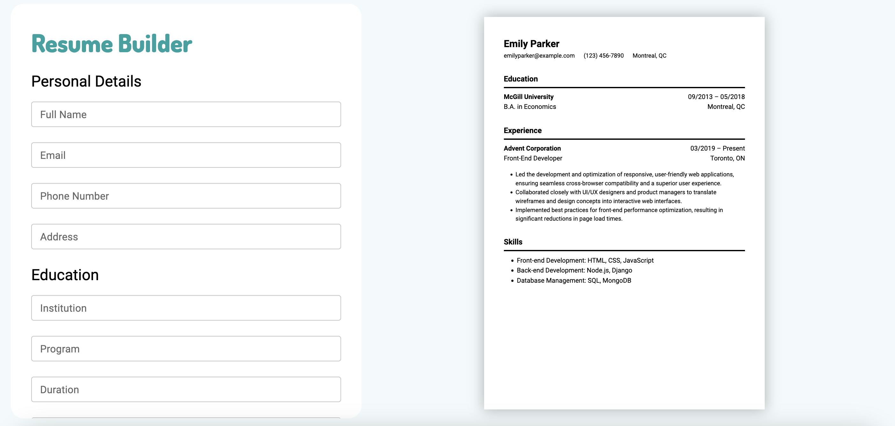

# Resume Builder

## [Live Demo](https://resume-builder-blush-rho.vercel.app/)

Resume builder web app. Part of The Odin Project curriculum.

### Features:

- Create and edit your personal details, education, experience, and skills.
- Visualize your resume in real time as you enter your information.
- Download your resume as PDF.

### Built with:

- React
- Vite
- Material UI
- HTML & CSS
- html2pdf.js

### Things to add:

- Different resume templates
- Ability to add or remove top sections
- Customizing font family, font size, and other styling options
